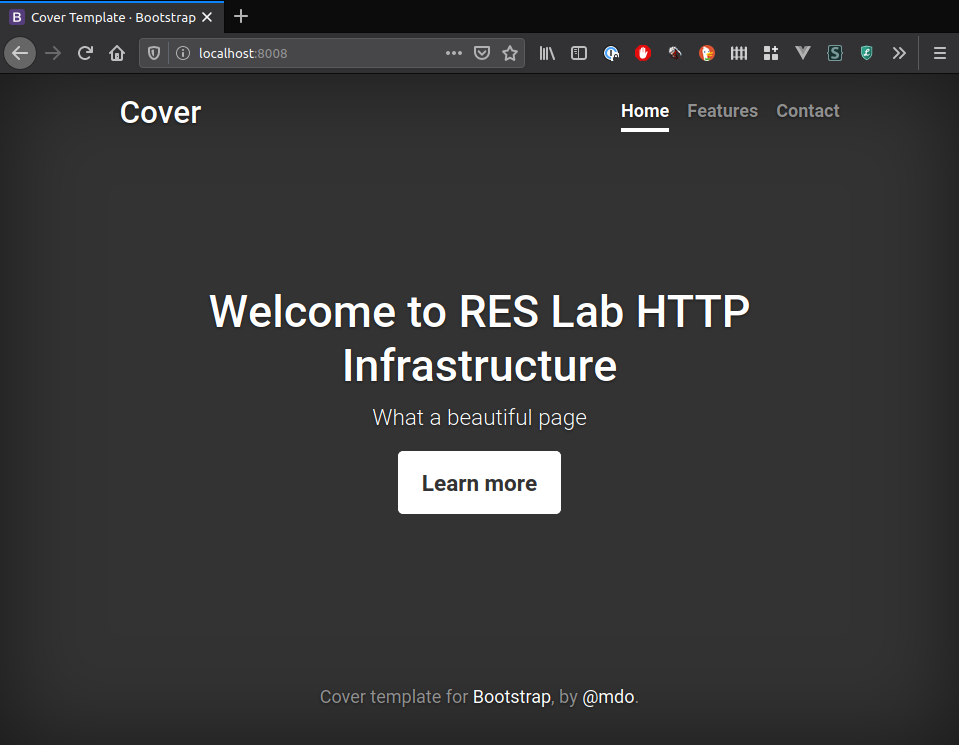

# HTTP Infrastructure

```
Author : Sacha Perdrizat, Pablo Mercado
```

## Step 1: Static HTTP server with apache httpd

Pour cette première étape nous allons creer un container exécutant un serveur HTTP pouvant servir des fichiers html
statique.

1. Créons d'abord un fichier Dockerfile qui va contenir la description de notre container 

```bash
$ touch Dockerfile
```

2. Recherchons ensuite sur le docker Hub une image docker existante, comme serveur HTTP nous allons utiliser Apache, il se trouve qu'une image existe sur le docker hub, nous allons utiliser l'image **php:apache** qui nous permettra plus tard de servir des page dynamique.

[](https://hub.docker.com/_/php/)

3. On écrit notre fichier Dockerfile

```Dockerfile
# image sur laquelle on va se baser
FROM php:7.2-apache

# notre repertoire courant à partir duquel les commandes sont lancés
WORKDIR /var/www/html

```

4. Maintenant il faut construire notre image avec le Dockerfile que l'on vient d'écrire

```bash
docker build -t res/http-server .

```

L'image désormais créer on peut l'observer dans nos images local

```
$ docker images
REPOSITORY          TAG                 IMAGE ID            CREATED             SIZE
res/http-server     latest              6b414e955353        6 days ago          410MB
```

5. Il maintenant temps de démarrer un container à partire de cette image

```bash
docker run -p 8008:80 -v $(pwd)/src/html:/var/www/html -d res/http-server
```

###  Cette commande mérite des détails

---

- Avec ``docker run`` nous allons créer un container et le lancer

 - Avec ``-p 8008:80`` nous allons rediriger les communication effectuer via le port 8008 sur le port 80 de notre container

 - Avec ``-v ./src/html:/var/wwww/html`` nous allons jumeler le répertoire /var/www/html avec notre répertoire src/html dans lequel se trouve nos fichiers statiques

- ``-d`` nous lancera le container en mode background

  ---

  

6. En parallèle nous avons créer un dossier ``src/html`` dans lequel nous avons inserer un fichier ``index.html`` ainsi que des feuilles de style dédié trouvé depuis [](https://getbootstrap.com/docs/4.4/examples/cover/).

7. Une fois le container lancé nous pouvons accédé à la page via le navigateur



   


## Step 2: Dynamic HTTP server with express.js

## Step 3: Reverse proxy with apache (static configuration)

## Step 4: AJAX requests with JQuery

## Step 5: Dynamic reverse proxy configuration

## Additional steps