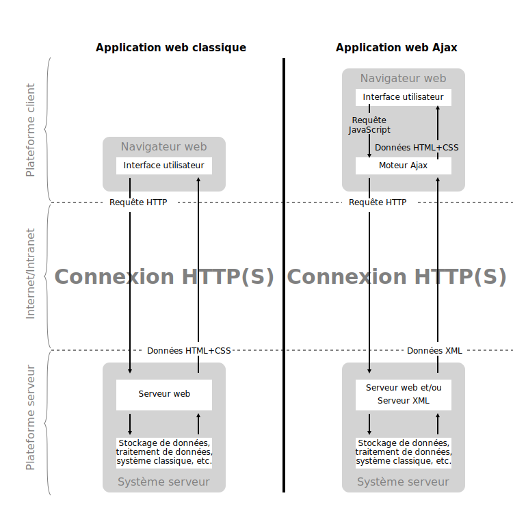

# HTTP Infrastructure

```
Author : Sacha Perdrizat, Pablo Mercado
```

## Step 4: AJAX requests with JQuery

Nos deux applications sont maintenant accessible via le reverse proxy, maintenant exploitons un peu les possibilité de notre server dynamique pour alimenter le contenu notre site statique.

### AJAX kézako

AJAX pour *asynchronous JavaScript and XML* est une méthode de développement web usant des diverse fonctionnalités rajouté aux navigateurs. Un exemple est nécessaire pour comprendre la nuance entre une applications web statique et AJAX



La différence principale dans une architecture AJAX est l'introduction d'une partie cliente qui va traiter les données reçu dans un certain format parsable (sur l'image du xml, mais actuellement on préfère l'utilisation du JSON), et c'est de coté client que sera mis à jour la DOM (ex. les éléments visuelles de la page), ainsi il évite au serveur de renvoyer l'entièreté de la page au client.

Il est à noter aussi que ces échanges sont asynchrone, ils ne nécessite pas l'interruption du programme et l'utilisateur peut toujours effectuer des actions sur la page.

*source : https://fr.wikipedia.org/wiki/Ajax_(informatique)*

### Mise en place de requêtes AJAX sur le site statique

Pour ce point nous allons récupérer les données JSON contenant nos personnes et afficher les nom sur notre site statique.

Réunissons déjà les ingrédients de base, il nous faudra

- Une library pour effectuer la requête (nous utiliserons JQuery)
- Un petit code JavaScript qui va altérer la DOM (nous le placerons dans le dossier ``step1/html/js``)

Nous allons récupérer la library JQuery simplement en téléchargeant sont contenus disponible [ici](https://jquery.com/download/) que nous placerons dans le dossier ``step1/html/js``. Nous allons creer le fichier JavaScript getName.js dans lequel nous mettrons notre petit bout de code.

maintenant il nous faut référencer ces fichier dans le fichier html principale.

```html
<!-- script pour effectuer les requêtes AJAX -->
<script src="./js/jquery.js" charset="utf-8"></script>
<script src="./js/getName.js" charset="utf-8"></script>
```
Et nous allons juste ajouter le code dans ``getName.js``

```JavaScript
// début du bloc JQuery
$(() => {
  function getPerson() {
    // on veut récuperer nos personnes (au format JSON) à l'URL /persons/
    $.getJSON("/persons/", function(response) {
        console.log(response);
        let value = "Johne Does";

        if (response.length > 0){
          value = `${response[0].fname} ${response[0].lname}`;
        }
        // Ici on va altérer l'éléments de notre DOM qui possède la class person
        $( ".person" ).text(value);
    });

  }
  // on va ré-éxécuter notre fonction toute les 2 secondes
  setInterval(getPerson,2000);
});

```
